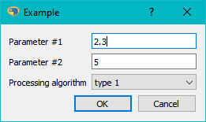
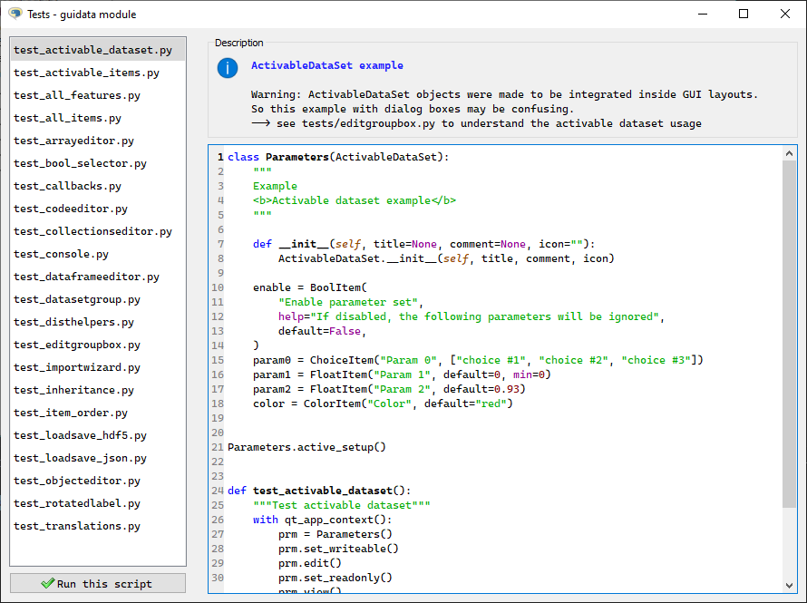
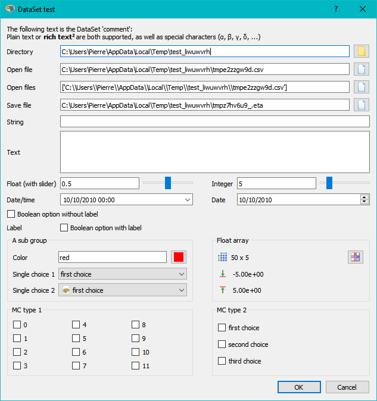
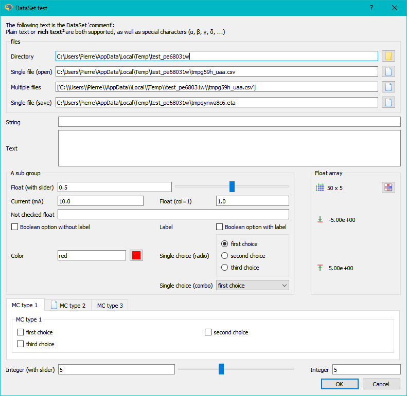
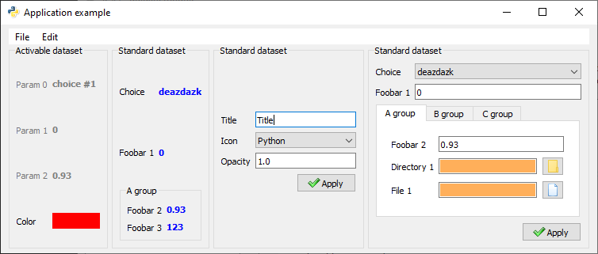
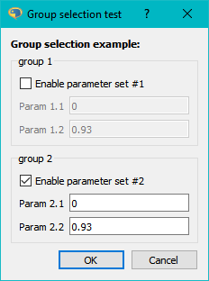
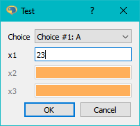
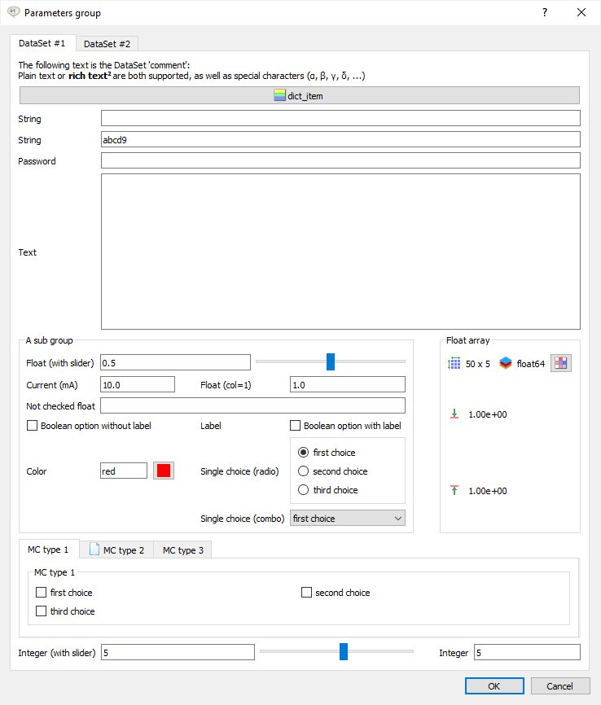

.. _examples:

Data set examples
=================

Basic example
-------------

Source code :

.. literalinclude:: basic_example.py

Other examples
--------------

A lot of examples are available in the :mod:`guidata` test module ::

    from guidata import tests
    tests.run()

The two lines above execute the `guidata test launcher` :

All :mod:`guidata` items demo
^^^^^^^^^^^^^^^^^^^^^^^^^^^^^

.. literalinclude:: ../guidata/tests/dataset/test_all_items.py
   :start-after: guitest:

All (GUI-related) :mod:`guidata` features demo
^^^^^^^^^^^^^^^^^^^^^^^^^^^^^^^^^^^^^^^^^^^^^^

.. literalinclude:: ../guidata/tests/dataset/test_all_features.py
   :start-after: guitest:

Embedding guidata objects in GUI layouts
^^^^^^^^^^^^^^^^^^^^^^^^^^^^^^^^^^^^^^^^

.. literalinclude:: ../guidata/tests/dataset/test_editgroupbox.py
   :start-after: guitest:

Data item groups and group selection
^^^^^^^^^^^^^^^^^^^^^^^^^^^^^^^^^^^^

.. literalinclude:: ../guidata/tests/dataset/test_bool_selector.py
   :start-after: guitest:

Activable data sets
^^^^^^^^^^^^^^^^^^^

.. literalinclude:: ../guidata/tests/dataset/test_activable_dataset.py
   :start-after: guitest:

Data set groups
^^^^^^^^^^^^^^^

.. literalinclude:: ../guidata/tests/dataset/test_datasetgroup.py
   :start-after: guitest:

Utilities
^^^^^^^^^

Update/restore a dataset from/to a dictionary
~~~~~~~~~~~~~~~~~~~~~~~~~~~~~~~~~~~~~~~~~~~~~

.. literalinclude:: ../guidata/tests/unit/test_updaterestoredataset.py
   :start-after: guitest:

Create a dataset class from a function signature
~~~~~~~~~~~~~~~~~~~~~~~~~~~~~~~~~~~~~~~~~~~~~~~~

.. literalinclude:: ../guidata/tests/unit/test_dataset_from_func.py
   :start-after: guitest:

Create a dataset class from a function dictionary
~~~~~~~~~~~~~~~~~~~~~~~~~~~~~~~~~~~~~~~~~~~~~~~~~

.. literalinclude:: ../guidata/tests/unit/test_dataset_from_dict.py
   :start-after: guitest:

Data set HDF5 serialization/deserialization
^^^^^^^^^^^^^^^^^^^^^^^^^^^^^^^^^^^^^^^^^^^

.. literalinclude:: ../guidata/tests/dataset/test_loadsave_hdf5.py
   :start-after: guitest:

Data set JSON serialization/deserialization
^^^^^^^^^^^^^^^^^^^^^^^^^^^^^^^^^^^^^^^^^^^

.. literalinclude:: ../guidata/tests/dataset/test_loadsave_json.py
   :start-after: guitest: