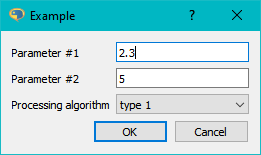
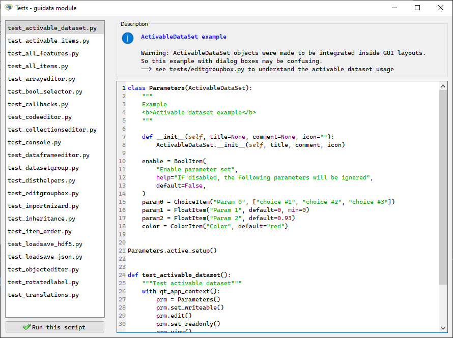
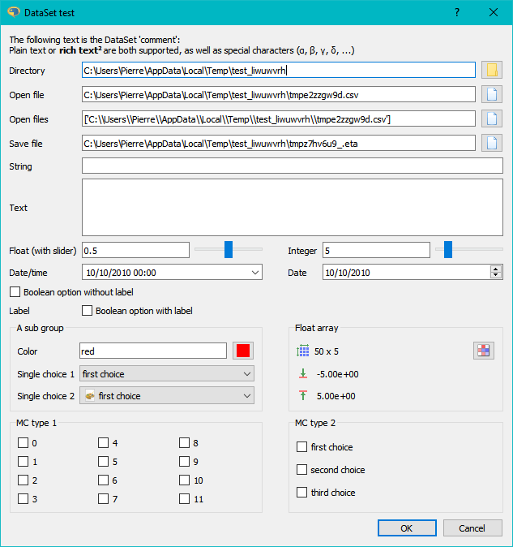
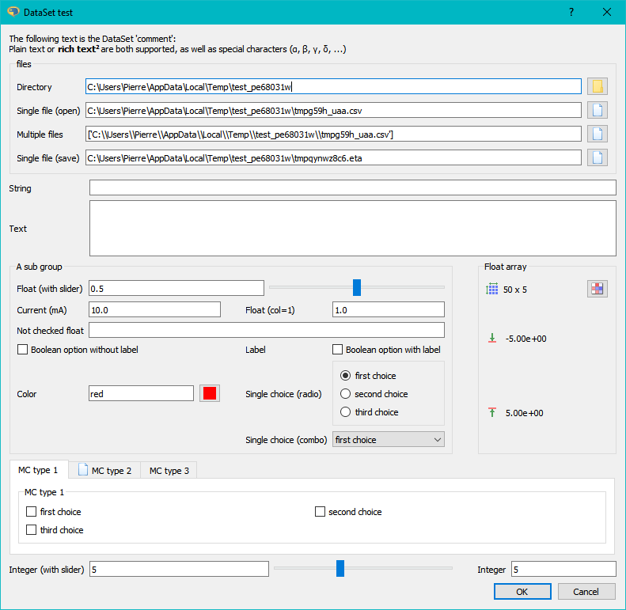
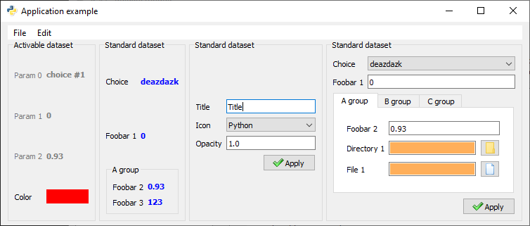
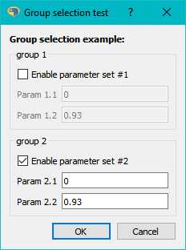
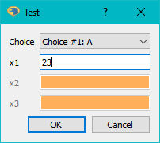
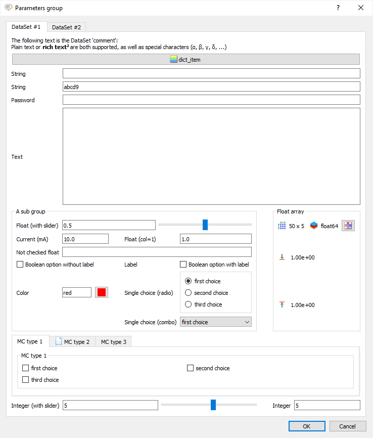

.. _examples:

Data set examples
=================

Basic example
-------------

Source code :

.. literalinclude:: basic_example.py

Other examples
--------------

A lot of examples are available in the :mod:`guidata` test module ::

    from guidata import tests
    tests.run()

The two lines above execute the `guidata test launcher` :

All :mod:`guidata` items demo
^^^^^^^^^^^^^^^^^^^^^^^^^^^^^

.. literalinclude:: ../guidata/tests/dataset/test_all_items.py
   :start-after: guitest:

All (GUI-related) :mod:`guidata` features demo
^^^^^^^^^^^^^^^^^^^^^^^^^^^^^^^^^^^^^^^^^^^^^^

.. literalinclude:: ../guidata/tests/dataset/test_all_features.py
   :start-after: guitest:

Embedding guidata objects in GUI layouts
^^^^^^^^^^^^^^^^^^^^^^^^^^^^^^^^^^^^^^^^

.. literalinclude:: ../guidata/tests/dataset/test_editgroupbox.py
   :start-after: guitest:

Local automatic sliders
~~~~~~~~~~~~~~~~~~~~~~~

An embedded ``DataSetEditLayout`` can opt into sliders without changing shared
``DataItem`` declarations or other forms::

   editor = DataSetEditLayout(
      parent, parameters, grid, change_callback=parameters_changed,
      auto_sliders=True, slider_steps=1000,
   )

The policy is inherited by nested groups and tabs. Editable numeric items need
finite, ordered, representable bounds; otherwise they remain text-only. Integer
parity is respected, and ranges crossing zero for ``nonzero`` items are not
automatically given sliders. For floats, a usable positive ``step`` is used when
practical, otherwise ``slider_steps`` specifies the normalized resolution. The
text field retains its exact value independently of the slider thumb.

``slider=True`` retains its existing behavior. Set
``item.set_prop("display", auto_slider=False)`` to exclude an item from the local
automatic policy. No bounds are inferred. The optional layout callback
``slider_callback(pressed)`` receives ``True`` at drag start and ``False`` at
release; value changes still use the existing ``change_callback``. Neither
callback automatically validates, accepts or applies the form. Use
``check_all_values()`` before ``accept_changes()`` when collecting a draft.

Data item groups and group selection
^^^^^^^^^^^^^^^^^^^^^^^^^^^^^^^^^^^^

.. literalinclude:: ../guidata/tests/dataset/test_bool_selector.py
   :start-after: guitest:

Activable data sets
^^^^^^^^^^^^^^^^^^^

.. literalinclude:: ../guidata/tests/dataset/test_activable_dataset.py
   :start-after: guitest:

Data set groups
^^^^^^^^^^^^^^^

.. literalinclude:: ../guidata/tests/dataset/test_datasetgroup.py
   :start-after: guitest:

Utilities
^^^^^^^^^

Update/restore a dataset from/to a dictionary
~~~~~~~~~~~~~~~~~~~~~~~~~~~~~~~~~~~~~~~~~~~~~

.. literalinclude:: ../guidata/tests/unit/test_updaterestoredataset.py
   :start-after: guitest:

Create a dataset class from a function signature
~~~~~~~~~~~~~~~~~~~~~~~~~~~~~~~~~~~~~~~~~~~~~~~~

.. literalinclude:: ../guidata/tests/unit/test_dataset_from_func.py
   :start-after: guitest:

Create a dataset class from a function dictionary
~~~~~~~~~~~~~~~~~~~~~~~~~~~~~~~~~~~~~~~~~~~~~~~~~

.. literalinclude:: ../guidata/tests/unit/test_dataset_from_dict.py
   :start-after: guitest:

Data set HDF5 serialization/deserialization
^^^^^^^^^^^^^^^^^^^^^^^^^^^^^^^^^^^^^^^^^^^

.. literalinclude:: ../guidata/tests/dataset/test_loadsave_hdf5.py
   :start-after: guitest:

Data set JSON serialization/deserialization
^^^^^^^^^^^^^^^^^^^^^^^^^^^^^^^^^^^^^^^^^^^

.. literalinclude:: ../guidata/tests/dataset/test_loadsave_json.py
   :start-after: guitest: