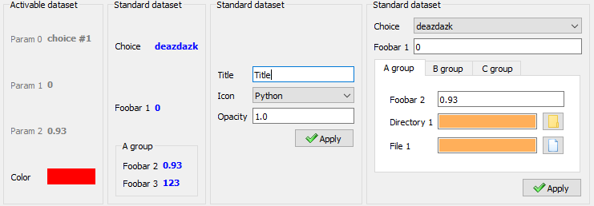

Welcome to :mod:`guidata`'s documentation!
==========================================

Based on the Qt library :mod:`guidata` is a Python library generating graphical
user interfaces for easy dataset editing and display. It also provides :ref:`widgets`
(Python console, code editor, array editor, etc. - see ), helpers and application
development tools for Qt.

    Simple example of layout generated by :mod:`guidata` (see :ref:`examples`).

:mod:`guidata` is part of the `PlotPyStack`_ project, which aims at providing
a full set of Python libraries for data plotting and data analysis.

External resources:

* Python Package Index: `PyPI`_

* Bug reports and feature requests: `GitHub`_

.. _PyPI: https://pypi.python.org/pypi/guidata
.. _GitHub: https://github.com/PlotPyStack/guidata/
.. _PlotPyStack: https://github.com/PlotPyStack

.. module:: guidata

Table of contents
-----------------

.. toctree::
   :maxdepth: 2

   overview
   installation
   examples
   widgets
   dev/index
   reference/index
   changelog

* :ref:`genindex`