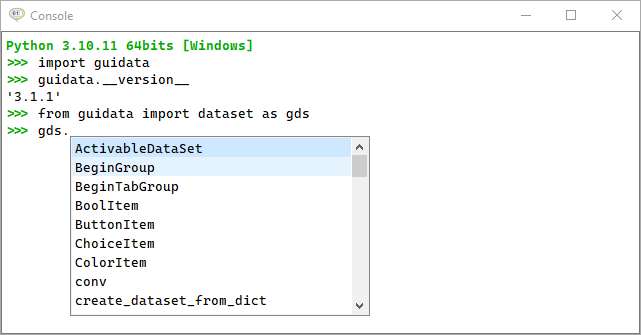
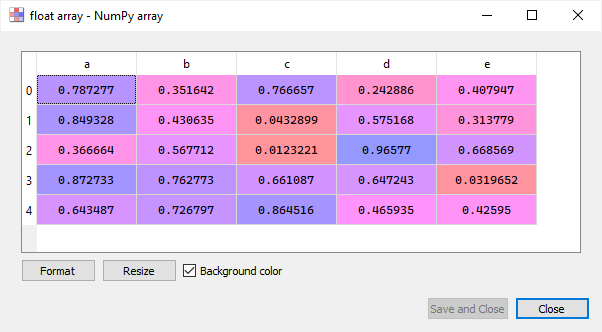
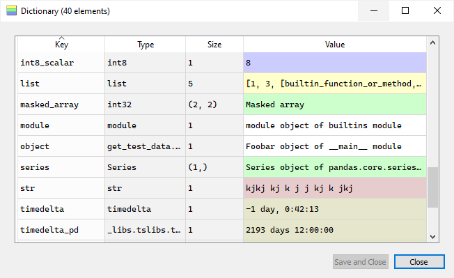
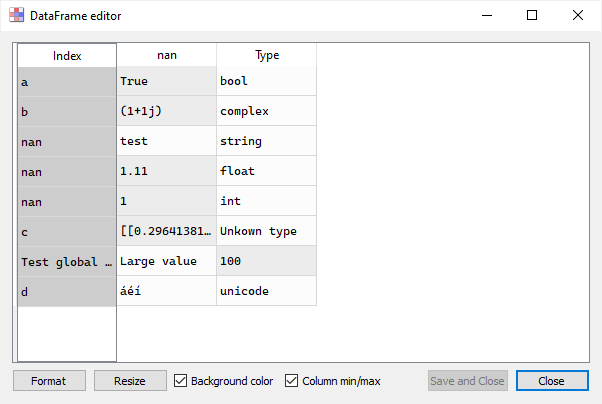
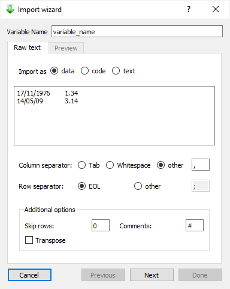

.. _widgets:

Ready-to-use widgets
====================

As a complement to the :py:mod:`guidata.dataset` module which focus on automatic
GUI generation for data sets editing and display, the :py:mod:`guidata.widgets`
module provides a set of ready-to-use widgets for building interactive GUIs.

.. note:: Most of the widgets originally come from the `Spyder`_ project
          (Copyright © Spyder Project Contributors, MIT-licensed). They were
          adapted to be used outside of the Spyder IDE and to be compatible with
          guidata internals.

.. _Spyder: https://github.com/spyder-ide/spyder

Python console
--------------

.. literalinclude:: ../guidata/tests/widgets/test_console.py
   :start-after: guitest:

Code editor
-----------

.. literalinclude:: ../guidata/tests/widgets/test_codeeditor.py
   :start-after: guitest:

.. image:: images/screenshots/codeeditor.png

Array editor
------------

.. literalinclude:: ../guidata/tests/widgets/test_arrayeditor.py
   :start-after: guitest:

Collection editor
-----------------

.. literalinclude:: ../guidata/tests/widgets/test_collectionseditor.py
   :start-after: guitest:

Dataframe editor
----------------

.. literalinclude:: ../guidata/tests/widgets/test_dataframeeditor.py
   :start-after: guitest:

Import wizard
-------------

.. literalinclude:: ../guidata/tests/widgets/test_importwizard.py
   :start-after: guitest:

